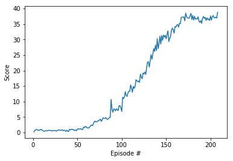
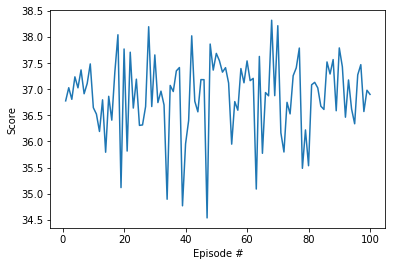

# Report

This is the detailed report on my implementation of the deep deterministic policy gradient algorithm (DDPG) for the Reacher environment. I will just go through part 4 of the [Continuous_Control.ipynb](Continuous_Control.ipynb)-notebook because the learning algorithm is implemented there. Note that in part 4 I mostly adapted the code from the bipedal notebook from the lesson about Actor-Critic Methods. Important things that were changed in the code from the bipedal notebook are:

* The gradient in the backpropagation step for the critic neural network is clipped (see line 109 in cell 7).
* The learning step is only carried out every 20 steps. But then it is done 10 times in a row (see lines 64-67 in cell 7).
* The rewards that the agents get are very small numbers from 0.01 to 0.04 most of the time. In order to stimulate training, every positive reward that is stored in the Replay-Buffer (and therefore used for training) is changed to 0.1. I want to point out that this really just affects the training. The collected scores per episode, that are used to test the performance of the agents, still just contain the actual rewards the agents get directly from the environment (see lines 17 and 20 in cell 12).
* In the OUNoise class, where the noise which gets added to the actions is created, the random distribution is changed from a uniform to a standard normal distribution (line 156 in cell 7).

Note also that the environment is already instantiated in part 1 of the notebook and referenced by the name "env".

Now to part 4:

In cell 6, in the Actor and Critic classes, the architecture of the neural networks, that will approximate the optimal policy pi and the optimal action value function Q, is defined. In the Actor class (lines 12 to 38) the structure of the neural network that will approximate the policy function is defined and has the following form:

* The input size is 33 which is precisely the dimension of the state vectors.
* There is one hidden layer of size 256 which is activated by the relu-function.
* The output layer is of size 4 (, which is the dimension of the action vectors) and is activated by the tanh-function.

In the Critic class (lines 41 to 74) the structure of the neural network that will approximate the action-value function Q is defined and has the following form:

* There is one input layer of size 33 (= state dimension). The input of that layer gets sent through a hidden layer of dimension 256 and a leaky relu-function is applied afterwards.
* The result after applying the leaky-relu gets concatenated with another input layer of size 4 (=action dimension).
* The result of this concatenation gets sent through two hidden layers (of dimensions 256 and 128). Both of those hidden layers are activated by a leaky relu function.
* The output layer has dimension 1 and no activation function is applied.

In cell 7 the Agent and ReplayBuffer classes are created, as well as the OUNoise class. But first some of the hyperparameters are already fixed here, namely:

* BUFFER_SIZE = 1000000   (number of stored experiences for the experience replay)
* BATCH_SIZE = 128        (batchsize of the batches that will be taken from the stored experiences during learning)
* GAMMA = 0.99            (discount rate)
* TAU = 0.001             (we will update the weights of the target network softly with factor TAU)
* LR_ACTOR = 0.0001       (learning rate for the actor neural network)
* LR_CRITIC = 0.0003      (learning rate for the critic neural network)
* WEIGHT_DECAY = 0.0001   (L2 weight decay for the critic)
* UPDATE_EVERY = 20       (the weights of the networks will only be updated every 20 steps)
* UPDATE_X_TIMES = 10     (when the weights get updated then they will updated 10 times in a row in a single timestep)

Then it is checked if a GPU is available and the device is set to GPU if that's the case; otherwise we will continue with CPU.  
In the Agent class (lines 23-136) there are 6 methods:  
In the \_\_init\_\_-method (lines 26-53) four neural networks are instantiated (respectively will get instantiated when an instance of type Agent gets created); two actor networks and two critic networks. Here one of the two critic networks (critic\_target) serves as the target function for the critic-learning step. One of the two actor networks (actor\_target) is used to choose the actions that are input into this target function for the critic-learning step. The other two networks (actor\_local and critic\_local) are the networks that later (after training) will approximate the optimal policy respectively the optimal action-value function. Furthermore the optimizers for the backward propagation steps for actor\_local and critic\_local are set to "Adam". Also the experience replay memory is initialized by creating a ReplayBuffer object and the noise that will later be added to the actions is initialized by creating an OUNoise-object.  
In the step- and learn-methods the important parts of the learning step are implemented (see lines 55-67 and 83-123): By calling the step-method the experience replay memory is updated and every 20 timesteps 10 batches from the memory are taken and the learn-method gets called 10 times (once per batch). By calling the learn-method forward-and backward propagation of actor\_local and critic\_local is carried out. Here the error of critic\_local is computed by using the target function critic\_target and actor\_local gets just maximized. Furthermore - by calling the soft\_update-method - actor\_target and critic\_target get updated softly with factor TAU (implementation of the soft\_update method is in lines 125-136).  
In the act-method (see lines 69-78) the behaviour of the agents (depending on the current estimate of the optimal policy actor\_local) is defined. One can see that the agents don't exactly act as guided by actor\_local but there is a noise that is added to the output of the network.   
In the Reset-method (lines 80-81) the noise gets resetted.  
In the OUNoise class (lines 138-158) the noise that will get added to the actions when the agents act is defined.  
In the ReplayBuffer class (lines 160-195) it is defined how to add experiences to the experience replay memory (in the add-method; lines 176-179) and how randomly created batches are chosen from the memory (in the sample-method; lines 181-191).

In cell 8 an instance of the Agent class is created.

In cell 12 the ddpg()-function is defined. By calling this function the DDPG-algorithm will actually be carried out. The training loop does the following things in each episode (until either the training went on for n_episodes=2000 episodes or the goal of having an average score of +30 over 100 consecutive episodes is reached):
* The environment is reset.
* The noise is reset.
* In every timestep of the episode the agents act, get a reward, a new state and the step-method is called. By calling the step-method the new experience is stored in the Repaly-Buffer and every 20 timesteps the agents learn.
* The cumulative reward that was achieved in the episode gets stored in the final\_scores-list and the final\_scores\_deque.

The final\_scores\_deque is used to check if the goal was reached in the current episode and the final\_scores-list is used for a plot later.

The goal was reached after a total number of 208 episodes. Since the average score over 100 consecutive episodes is checked, this means that the environment was solved after 108 episodes.

The achieved total reward per epsisode is plotted. This plot you can also see here:

In cell 9 the trained agents are run for 100 more episodes in the Reacher-Environment to check their performance. The scores that were achieved in every episode are plotted. This plot you can also see here:

In the last cell the environment gets closed.

### Ideas for future work

I just adapted the hyperparameters from the Deep Q-Networks coding exercise and they worked well enough. But I haven't really played around with the hyperparameters and I would guess that there are still some possibilities to tweak them.

Furthermore one could try out the six extensions of the DQN algorithm that were implemented in the Rainbow algorithm:
* Double DQN
* Prioritized experience replay 
* Dueling DQN 
* Learning from multi-step bootstrap targets
* Distributional DQN
* Noisy DQN

I have no a priori idea if those extensions would give performance improvement for the Banana-Collector environment but at least these are definitely things one could try out.
